  

  

  
  

---

### 🚀 About Me

- 🔭 I'm currently working on **[Official Website of WCE IT-Department](https://github.com/jagtapvarad17-stack/WCE-IT-)**
- 🌱 I'm currently learning **Spring Boot and Spring AI**
- 📫 How to reach me: **anujpisal69@gmail.com**
- 📄 Know more about me **[here](https://drive.google.com/file/d/1OdeYYXR-zg_1xy8ddTo8Ro3T2Uz342R5/view?usp=sharing)**

---

### 🌐 Connect with me

---

### 🛠️ Languages & Tools

**Languages**

  

**Frontend & Frameworks**

  

**Backend**

  

**Databases**

  

**DevOps & Cloud**

  

**Tools**

  

---

### 📊 GitHub Stats

  
  

  

---

### 📈 GitHub Activity Graph

  

---

### 🏆 GitHub Trophies

  

---

### 🐍 Contribution Snake

  

